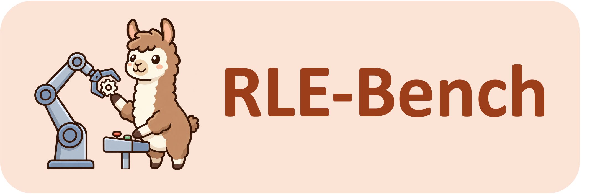

<p align="center">
  
</p>

<p align="center">
  <strong>A Qualifying Exam for Coding Agents as Robot Learning Engineers</strong>
</p>

<p align="center">
  <a href="LICENSE"></a>
  <a href="pyproject.toml"></a>
  <a href="https://github.com/laude-institute/harbor"></a>
  <a href="https://rle-bench.github.io/"></a>
</p>


## 📰 News

- **[2026-09-14]:** The [RLE-Bench leaderboard](https://rle-bench.github.io/) is live — browse agent results across the nine task families. Read [Introducing RLE-Bench](https://rle-bench.github.io/blog/) for an overview of the benchmark, evaluation methodology, results, and task demos.

## 👋 Overview

RLE-Bench evaluates whether coding agents can solve robotics engineering
problems across learning, control, mechanical design, and perception. Each
task provides an engineering specification, a containerized workspace, and
task-specific tools and resource budgets. The agent develops a solution;
the benchmark evaluates its behavior in simulation.

- **Grounded in physics.** Simulators let agents observe three-dimensional
  environments and reason about the physical consequences of their actions.
  Evaluation measures how their solutions behave in these environments.
- **Multimodal feedback.** Agents use visual observations alongside text to
  assess outcomes and refine their decisions through repeated cycles of
  observation, action, and experimentation.
- **Full-stack robotics engineering.** We envision an agentic system that not only
  controls robots, but can also develops and trains policies, builds perception systems,
  and designs robot embodiments for recursive improvement. Our nine task families span these capabilities.

The repository provides nine task families, simulation environments, scoring
harnesses, and a command-line interface for running and inspecting evaluations
with [Harbor](https://github.com/laude-institute/harbor).

## 🤖 Benchmark tasks

Nine tasks span four engineering categories. Follow each task's link for setup,
variants, and scoring details.

| Task                             | Category                | Description                                             | GPU required |
| :------------------------------- | :---------------------- | :------------------------------------------------------ | :----------- |
| [task01](tasks/task01/README.md) | Interactive Control     | Solve kitchen manipulation tasks with agent in the loop | Yes          |
| [task02](tasks/task02/README.md) | Interactive Control     | Build reusable harnesses and skills for future tasks    | Yes          |
| [task03](tasks/task03/README.md) | Interactive Control     | Solve embodied reasoning challenges.                    | Yes          |
| [task04](tasks/task04/README.md) | Policy Development      | Train a humanoid motion-tracking policy                 | Yes          |
| [task05](tasks/task05/README.md) | Policy Development      | Train a VLA policy under a metered replay budget        | Yes          |
| [task06](tasks/task06/README.md) | Perception & Estimation | Estimate object poses under adversarial sensing         | Varies       |
| [task07](tasks/task07/README.md) | Perception & Estimation | Clear cluttered bins with sensory feedback              | No           |
| [task08](tasks/task08/README.md) | Mechanical Design       | Design a mobile manipulator base                        | No           |
| [task09](tasks/task09/README.md) | Mechanical Design       | Co-design teleoperation hardware and software           | No           |

## 🚀 Getting started

Use a Linux host with Git, Make, [uv](https://docs.astral.sh/uv/), and a running
[Docker](https://docs.docker.com/engine/install/) daemon. GPU tasks also need
an NVIDIA GPU and GPU access from Docker. Simulator datasets and model weights
depend on the selected family; consult its documentation before preparing it.

### 📦 Install

```bash
git clone https://github.com/RLE-Bench/RLE-Bench.git
cd RLE-Bench
make install
source .venv/bin/activate
```

`make install` creates a Python 3.12 environment and installs the benchmark CLI,
Harbor, and pinned dependencies. Run commands from the repository root.

```bash
rlebench list
rlebench doctor
```

`list` shows task families and preparation status. `doctor` checks the local
environment and reports missing dependencies.

## 🧪 Running evaluations

Prepare the desired family and configure credentials for your agent and provider.
For the Claude Code example below, set `ANTHROPIC_API_KEY` or
`ANTHROPIC_AUTH_TOKEN`, then replace `MODEL_NAME` with a model available to your
account:

```bash
rlebench prepare task08
rlebench run task08 -a claude-code -m "anthropic/MODEL_NAME"
```

`prepare` stages generated assets and builds the required images. Run it before
evaluating a family on a fresh clone.

Targets can select an entire family, a level or group, or an individual task:

| Scope           | Example target             |
| :-------------- | :------------------------- |
| Family          | `task01`                   |
| Level           | `task01/L1`                |
| Individual task | `task01/L1/01-open-fridge` |
| Sensor variant  | `task06/rgb-only`          |

For a GPU evaluation, specify the device explicitly:

```bash
rlebench prepare task01
rlebench run task01/L1/01-open-fridge \
  -a claude-code -m "anthropic/MODEL_NAME" --device cuda:0
```

Use `-a` to select the agent, `-m` for the model, and `-e / --endpoint` for a provider's
endpoint and credential configuration. `rlebench run --help` lists supported
agents, configurations, and defaults. Add `--dry-run` to preview commands;
arguments after `--` are passed directly to Harbor.

**Experimental:** Run Claude Code or Codex against your own model service.
See [self-hosted models](docs/self-hosted-models.md) for setup and compatibility.

### 📊 Inspect results

```bash
rlebench summarize jobs
rlebench view jobs
```

`summarize` writes `summary.json` and `report.md` with run statuses, rewards,
and reported costs, grouped by task and agent/model. `view` opens a browser
interface for exploring trajectories, verifier results, and recorded media.

## 🗂️ Repository structure

```text
rlebench/       Evaluation CLI, agent adapters, result viewer, and shared scoring utilities
tasks/          Task specifications, environments, harnesses, and verifiers
sim/            Pinned simulator stacks and build scripts
assets/robots/  Shared robot descriptions and their licenses
tests/          Host-side test suites
```

Task assets and image payloads are generated from source. Use
`make task08-assets` to stage one family, or `make task-assets` to stage all
families without building Docker images. Shared simulator setup is documented
under [sim/](sim/).

## 📚 Citation

If you use RLE-Bench, or results produced with it, please cite:

```bibtex
@misc{rlebench2026,
  title        = {RLE-Bench: A Qualifying Exam for Coding Agents as Robot Learning Engineers},
  author       = {{RLE-Bench contributors}},
  year         = {2026},
  howpublished = {\url{https://github.com/RLE-Bench/RLE-Bench}},
}
```

## 📄 License

RLE-Bench is licensed under the [MIT License](LICENSE). Vendored robot models,
datasets, and external dependencies retain their respective licenses; see
[THIRD_PARTY_NOTICES.md](THIRD_PARTY_NOTICES.md).
